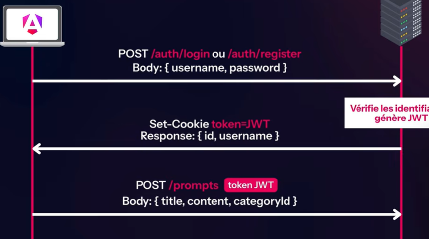

# Prompt Hub — Frontend

Application Angular pour **Prompt Hub** : partage et découverte de prompts (liste, création, édition, votes, catégories).

Projet pensé pour **apprendre Angular moderne** (standalone, signals, zoneless, formulaires, librairie de composants, routing, guards, authentification, etc.) avec un backend API REST proche d’un environnement entreprise.


## Lancer le projet

```bash
npm install
npm start
```

Ouvre `http://localhost:4200/`. Le backend (NestJS, port 3000) doit tourner pour que l’app fonctionne.
## Architecture & Authentification

